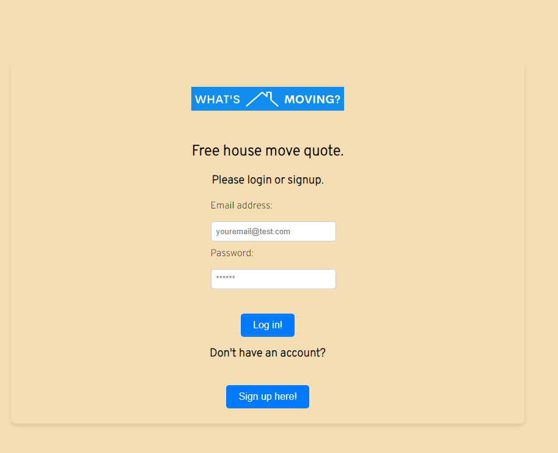
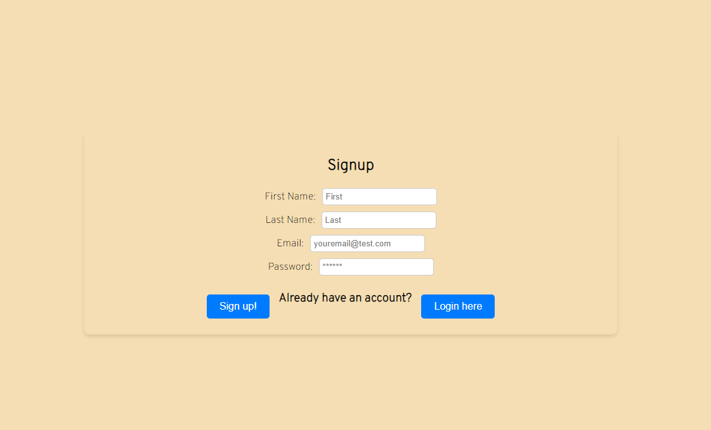
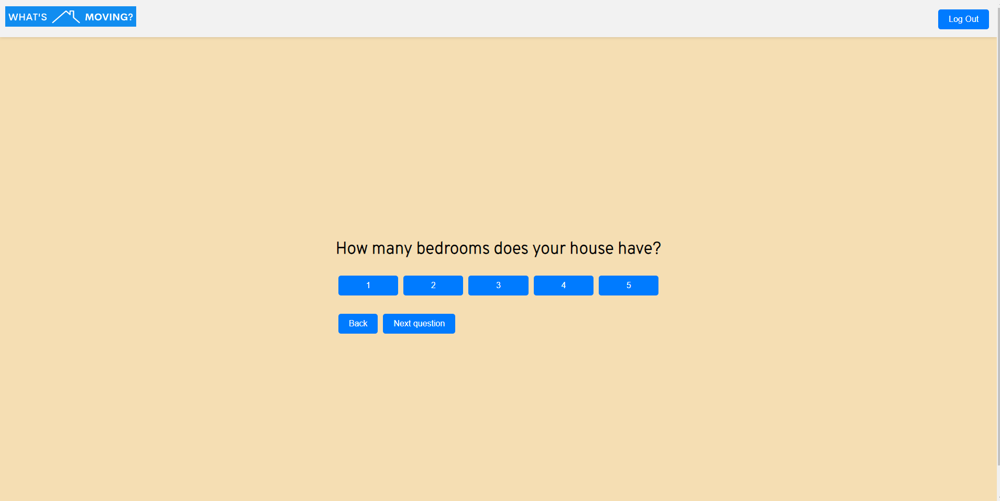
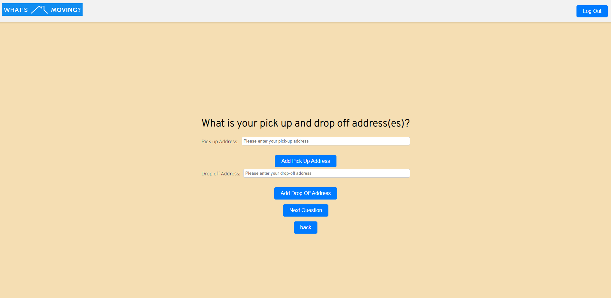
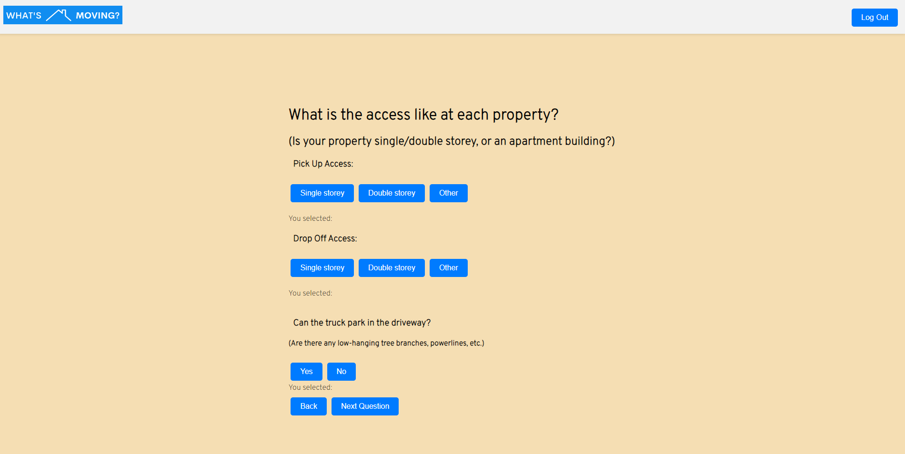
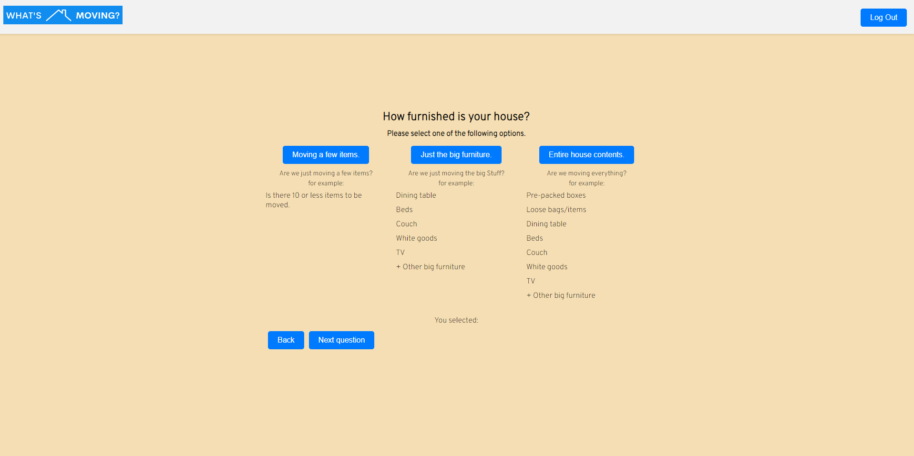
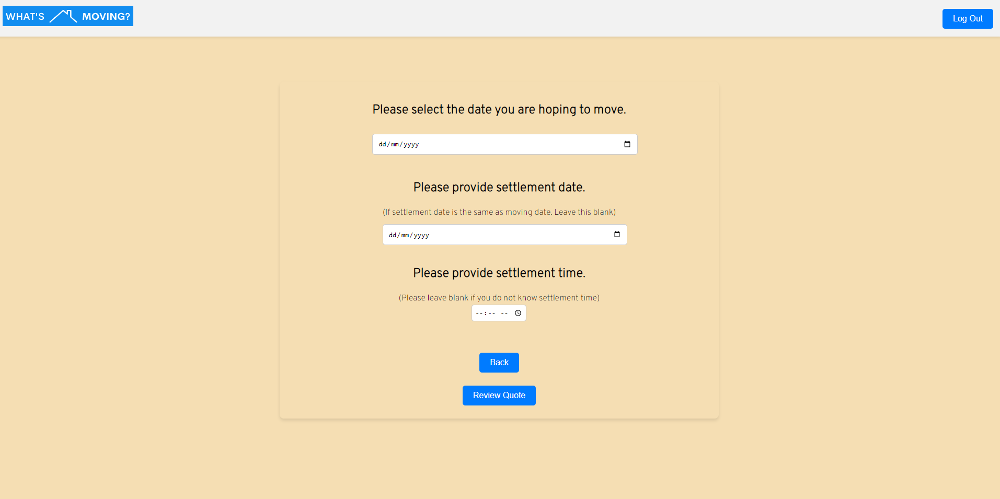
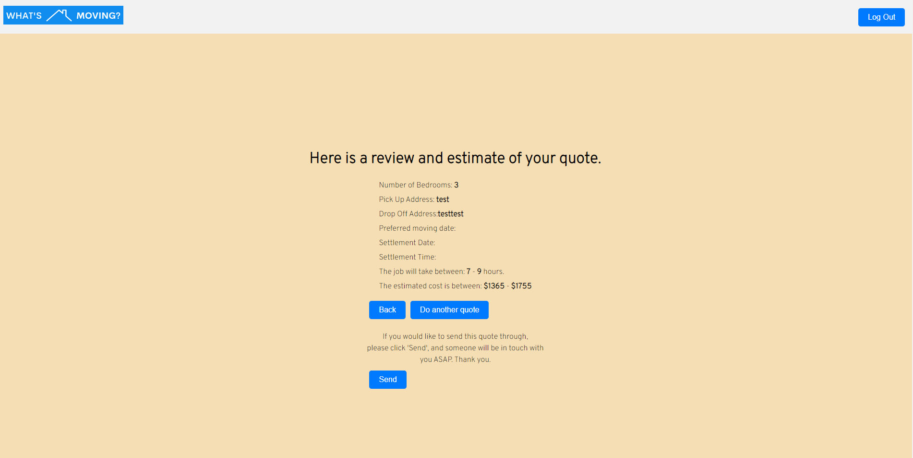

# What's Moving?

## Description 
What's Moving is an application where the user answers 5 simple questions about there house and in return are provided with a rough estimate of how long the job will take, and how much it will cost.

## Screenshots

This is the login page

this is the signup page

this is the landing page

This is the questions in order of 1-5.

This is the quote review page

## Table of contents
- [Go to Installation](#installation) 
- [Go to Usage](#usage) 
- [Go to Contributing](#contributing) 
- [Go to Tests](#tests)
- [Go to License](#license)
- [Go to Questions](#questions)

## Installation
To install this website to your computer. Clone the repo, open up vscode, type ``npm install`` in the termninal followed by ``npm run develop``
    
## Usage
The usage of this website is to quickly and efficiently get a quote for a house move without having to call and wait for a call back or email and wait for a reply. It gives the user an answer instantly.

## Contributing
N/A

## Tests
N/A

## License

## Questions

Please checkout my Github account: https://github.com/Joshua-Watson96 

Please e-mail me with any further questions:  joshjkwatson@gmail.com